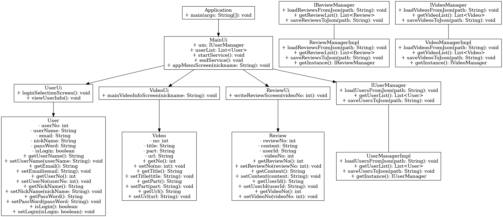

# MenuBoard 클래스 다이어그램 설계 과정

## 프로젝트 개요
MenuBoard 프로젝트는 사용자, 리뷰, 비디오 등을 관리하는 애플리케이션입니다. 이 README 파일은 프로젝트의 클래스 다이어그램을 설계하는 과정을 설명합니다.

## 클래스 다이어그램 구성 요소
클래스 다이어그램은 다음과 같은 주요 구성 요소로 이루어져 있습니다:
- 클래스(Class): 속성과 메서드를 포함하며, 시스템의 객체를 나타냅니다.
- 인터페이스(Interface): 클래스에서 구현해야 하는 메서드의 집합을 정의합니다.
- 관계(Relationship): 클래스 간의 상속, 구현, 의존성 등을 나타냅니다.

## 클래스 다이어그램 설계 단계

### 1. 클래스 식별
프로젝트의 요구사항을 바탕으로 주요 클래스를 식별합니다. 이 프로젝트에서는 다음과 같은 클래스를 사용합니다:
- Controller 패키지:
  - `Application`
  - `MainUi`
  - `ReviewUi`
  - `UserUi`
  - `Util`
  - `VideoUi`
- Model 패키지:
  - `Review`
  - `User`
  - `Video`
- View 패키지:
  - `IReviewManager`
  - `IUserManager`
  - `IVideoManager`
  - `ReviewManagerImpl`
  - `UserManagerImpl`
  - `VideoManagerImpl`

### 2. 클래스 구조 정의
각 클래스의 속성과 메서드를 정의합니다. 접근 제한자는 다음과 같이 표기합니다:
- `+` : public
- `-` : private
- `#` : protected
- `~` : default

### 클래스 목록 및 정의
#### Controller 패키지
- **Application**
  - 메서드: `+ main(String[] args): void`

- **MainUi**
  - 속성: `+ userList: List<User>`
  - 메서드: `- MainUi()`, `+ 서비스시작(): void`, `+ 서비스종료(): void`, `+ 앱메뉴화면(String nickname): void`

- **ReviewUi**
  - 속성: `- instance: ReviewUi`, `+ userList: List<User>`, `+ reviewList: List<Review>`
  - 메서드: `- ReviewUi()`, `+ getInstance(): ReviewUi`, `+ 리뷰상세화면(int videoNo): int`, `+ 리뷰메뉴화면(int videoNo, String nickname): void`, `+ 리뷰등록화면(int videoNo): void`

- **UserUi**
  - 속성: `- instance: UserUi`, `+ userList: List<User>`
  - 메서드: `- UserUi()`, `+ getInstance(): UserUi`, `+ 회원정보조회(): void`, `+ 로그인선택화면(): void`, `+ 로그인화면(): void`, `+ 회원가입화면(): void`, `- validateUserInput(String username, String email, String nickName, String passWord): boolean`, `- getLoggedInUser(): User`

- **Util**
  - 메서드: `+ input(String msg): String`, `+ inputInt(String msg): int`, `+ printLine(): void`, `+ printLine(char ch): void`, `+ printLine(char ch, int len): void`, `+ screenClear(): void`

- **VideoUi**
  - 속성: `- instance: VideoUi`, `+ list: List<Video>`
  - 메서드: `- VideoUi()`, `+ selectVideo(int no): Video`, `+ videoListView(): void`

#### Model 패키지
- **Review**
  - 속성: `- reviewId: int`, `- userId: int`, `- videoId: int`, `- content: String`, `- rating: int`
  - 메서드: `+ getReviewId(): int`, `+ getUserId(): int`, `+ getVideoId(): int`, `+ getContent(): String`, `+ getRating(): int`, `+ setReviewId(int reviewId): void`, `+ setUserId(int userId): void`, `+ setVideoId(int videoId): void`, `+ setContent(String content): void`, `+ setRating(int rating): void`

- **User**
  - 속성: `- userId: int`, `- username: String`, `- email: String`, `- nickname: String`, `- password: String`
  - 메서드: `+ getUserId(): int`, `+ getUsername(): String`, `+ getEmail(): String`, `+ getNickname(): String`, `+ getPassword(): String`, `+ setUserId(int userId): void`, `+ setUsername(String username): void`, `+ setEmail(String email): void`, `+ setNickname(String nickname): void`, `+ setPassword(String password): void`

- **Video**
  - 속성: `- videoId: int`, `- title: String`, `- genre: String`, `- url: String`
  - 메서드: `+ getVideoId(): int`, `+ getTitle(): String`, `+ getGenre(): String`, `+ getUrl(): String`, `+ setVideoId(int videoId): void`, `+ setTitle(String title): void`, `+ setGenre(String genre): void`, `+ setUrl(String url): void`

#### View 패키지
- **IReviewManager**
  - 메서드: `+ insertReview(Review review): int`, `+ selectReview(int videoNo): List<Review>`, `+ loadReviewsFromJson(String filePath): void`, `+ saveReviewsToJson(String filePath): void`

- **IUserManager**
  - 메서드: `+ register(User user): int`, `+ login(String nickName, String passWord): User`, `+ loadUsersFromJson(String filePath): void`, `+ saveUsersToJson(String filePath): void`

- **IVideoManager**
  - 메서드: `+ getList(): List<Video>`, `+ selectVideoByNo(int no): Video`, `+ loadVideosFromJson(String filePath): void`

- **ReviewManagerImpl**
  - 속성: `- reviewList: List<Review>`, `- instance: IReviewManager`
  - 메서드: `- ReviewManagerImpl()`, `+ getInstance(): IReviewManager`, `+ getReviewList(): List<Review>`, `+ insertReview(Review review): int`, `+ selectReview(int videoNo): List<Review>`, `+ loadReviewsFromJson(String filePath): void`, `+ saveReviewsToJson(String filePath): void`

- **UserManagerImpl**
  - 속성: `- userList: List<User>`, `- instance: IUserManager`
  - 메서드: `- UserManagerImpl()`, `+ getInstance(): IUserManager`, `+ getUserList(): List<User>`, `+ register(User user): int`, `+ login(String nickName, String passWord): User`, `+ loadUsersFromJson(String filePath): void`, `+ saveUsersToJson(String filePath): void`

- **VideoManagerImpl**
  - 속성: `- list: List<Video>`, `- instance: IVideoManager`
  - 메서드: `- VideoManagerImpl()`, `+ getInstance(): IVideoManager`, `+ getList(): List<Video>`, `+ selectVideoByNo(int no): Video`, `+ loadVideosFromJson(String filePath): void`

### 3. 클래스 간의 관계 정의
클래스 간의 관계를 정의합니다:
- 상속 (Inheritance): 빈 삼각형 화살표
- 구현 (Realization): 빈 삼각형 화살표 + 점선
- 의존 (Dependency): 점선 화살표
- 연관 (Association): 실선 또는 화살표 실선

### 4. 다이어그램 그리기
위의 정보를 바탕으로 클래스 다이어그램을 그립니다. 다이어그램은 각 클래스의 위치와 관계를 시각적으로 표현합니다.

## 클래스 다이어그램
다음은 최종 클래스 다이어그램입니다:

## 결론
이 클래스 다이어그램은 MenuBoard 프로젝트의 구조를 이해하는 데 도움이 됩니다. 각 클래스와 인터페이스의 역할 및 상호 관계를 시각적으로 표현하여 프로젝트의 설계를 명확히 파악할 수 있습니다.
